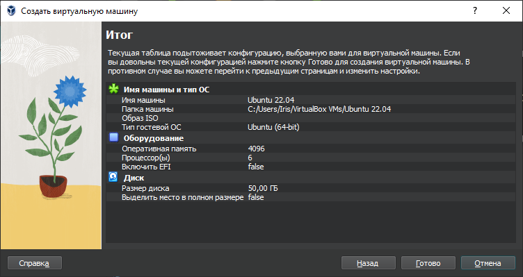
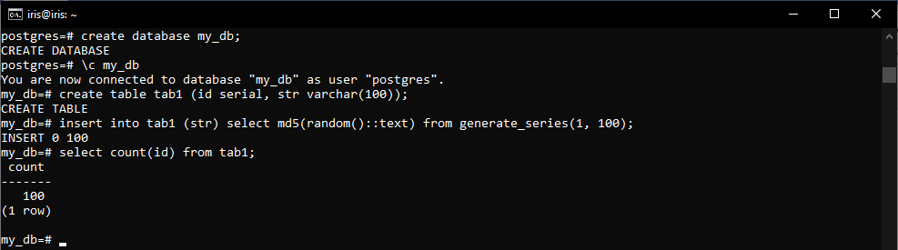
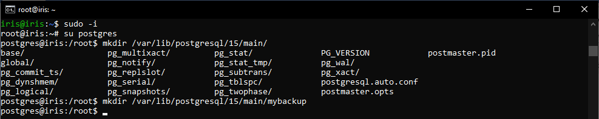
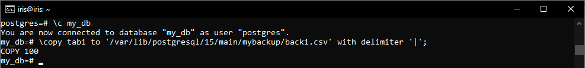
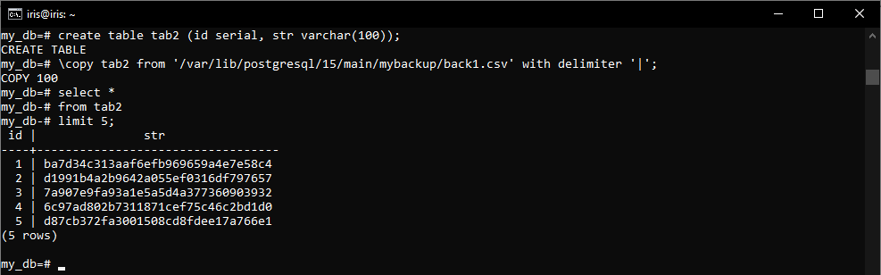
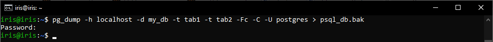
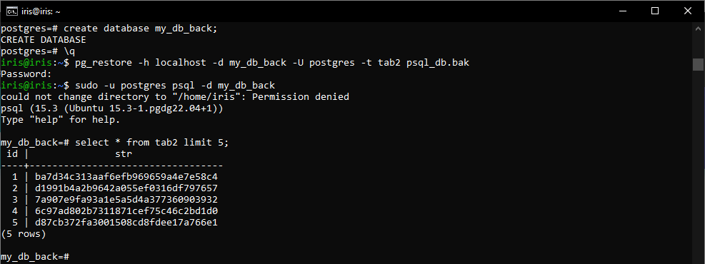

# Домашнее задание №9
1. Создаем ВМ/докер c ПГ.

2. Создаем БД, схему и в ней таблицу. Заполним таблицу автосгенерированными 100 записями.

3. Под линукс пользователем Postgres создадим каталог для бэкапов

4. Сделаем логический бэкап используя утилиту COPY

5. Восстановим во вторую таблицу данные из бэкапа.

6. Используя утилиту pg_dump создадим бэкап в кастомном сжатом формате двух таблиц

> Перед этим необходимо установить пароль для postgres.

7. Используя утилиту pg_restore восстановим в новую БД только вторую таблицу!

