# Домашнее задание №2
1. Развернута ВМ *Ubuntu Server 22.04*

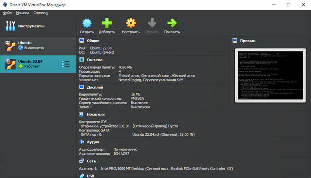

2. Установлен Docker Engine (https://docs.docker.com/engine/install/ubuntu/)

Перед первой установкой Docker Engine на новый хост необходимо настроить репозиторий Docker, после чего появится возможность установить и обновить Docker из репозитория.
Порядок установки:
- Обновить пакеты:

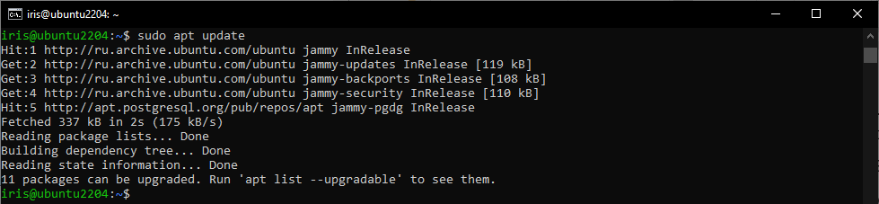

- Установить пакеты, которые необходимы для работы пакетного менеджера apt по протоколу HTTPS:

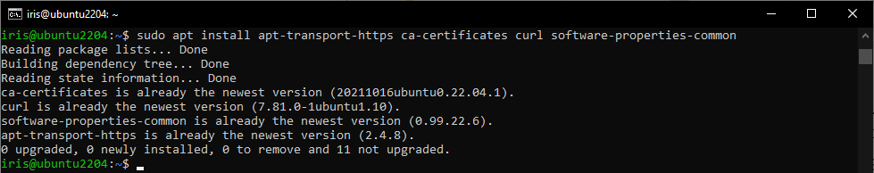

- Добавить GPG-ключ репозитория Docker:

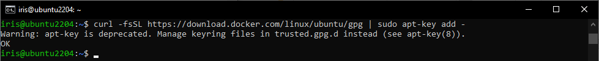

- Добавить репозиторий Docker:

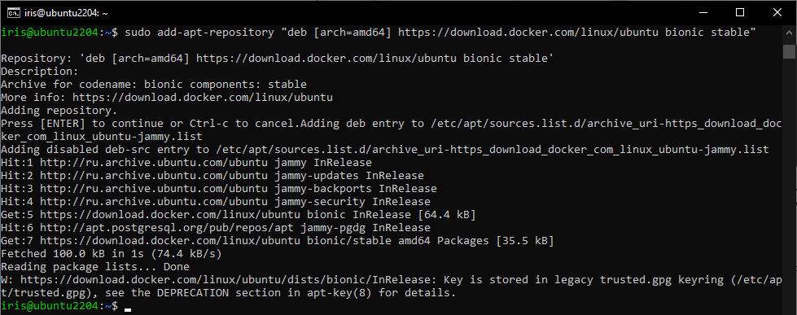

- Обновить пакеты:

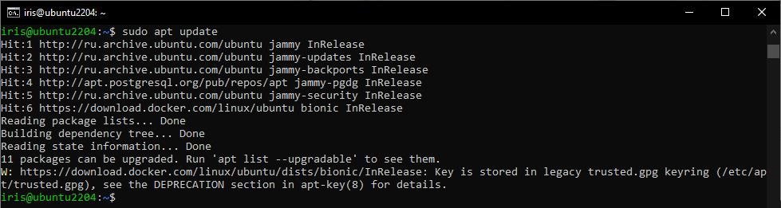
 
- Переключиться в репозиторий Docker, чтобы его установить. В терминале должна появиться подобная информация с версией Docker:

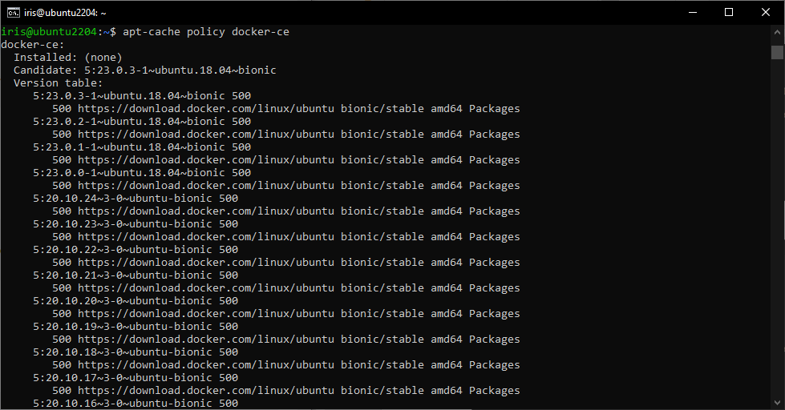

- Установить Docker:

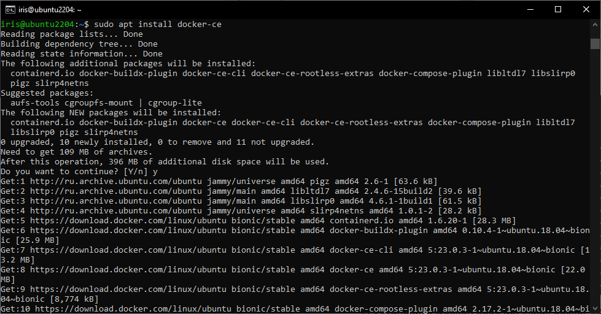
 
- Проверить работоспособность программы. В терминале должна появиться информация о том, что Docker активен:

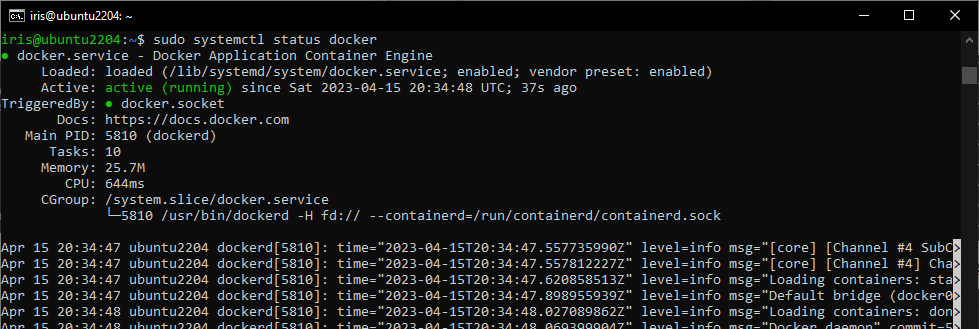
 
- Чтобы использовать утилиту docker, нужно добавить ваше имя пользователя в группу Docker. Для этого необходимо ввести в терминале команду: *sudo usermod -aG docker ${user}*, где *${user}* – имя пользователя.
 
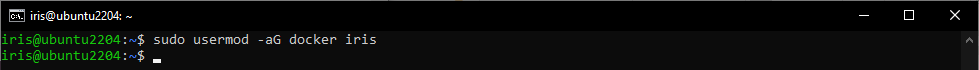

- Ввести: *su - ${user}*, где *${user}* – имя пользователя. Введите пароль пользователя, когда его запросит терминал.

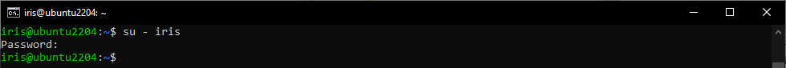
 
- Проверить доступ к образам Docker. Если вы увидите сообщение «Hello from Docker!», то всё установлено верно.

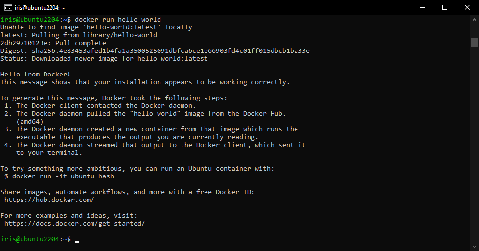
 
3. Создан каталог /var/lib/postgres:

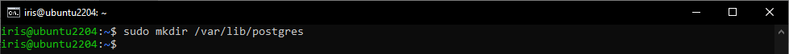

4. Развернут контейнер с PostgreSQL 15 смонтировав в него /var/lib/postgresql
 
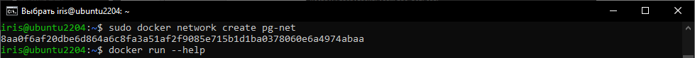
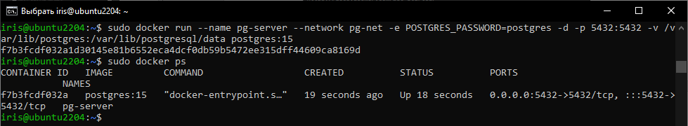

5. Развернут контейнер с клиентом postgres

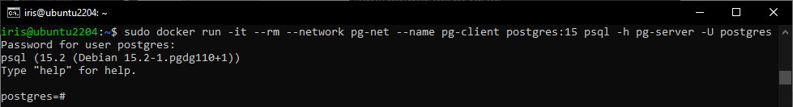
 
6. Подключено из контейнера с клиентом к контейнеру с сервером. Создана таблица с парой строк:

    ```
     create table persons(id serial, first_name text, second_name text);
     insert into persons(first_name, second_name) values('ivan', 'ivanov');
     insert into persons(first_name, second_name) values('petr', 'petrov');
    ```
 
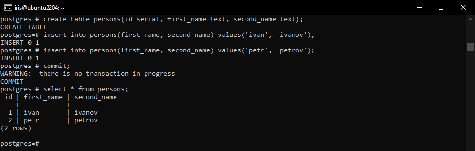

7. Подключено к контейнеру с сервером с компьютера извне:

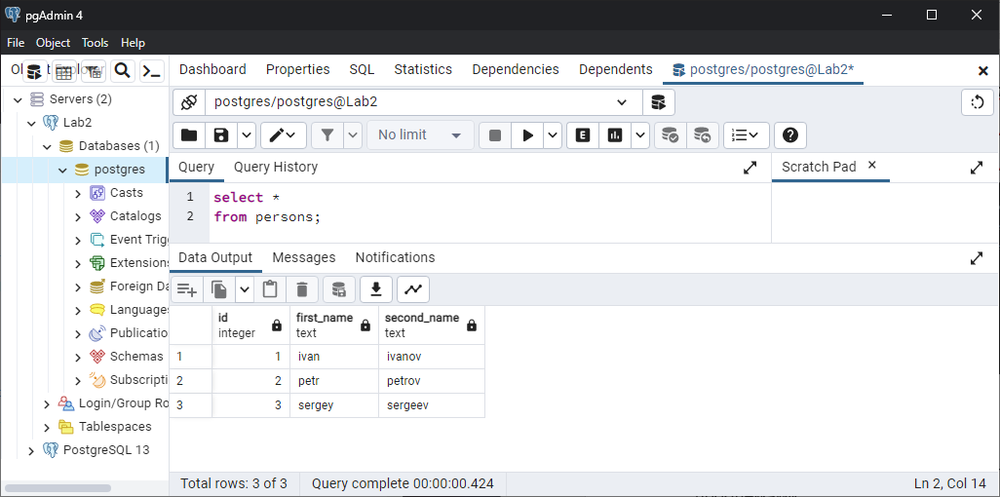

8. Удален контейнер с сервером:

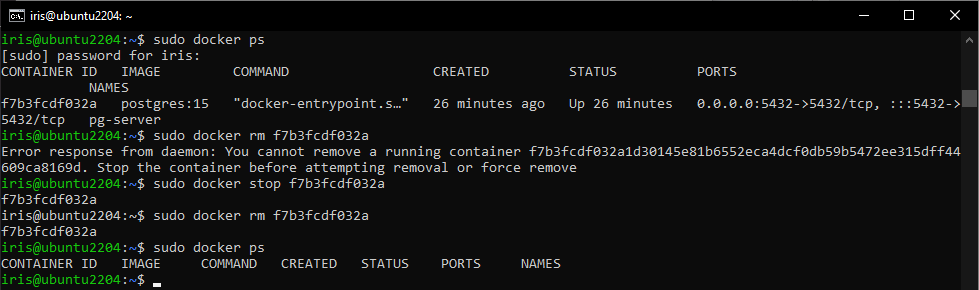
 
9. Заново создан контейнер с сервером:

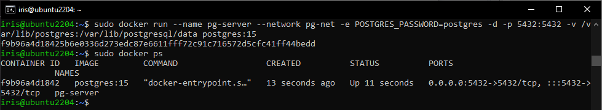

10. Подключено из контейнера с клиентом к контейнеру с сервером. Данные остались на месте:

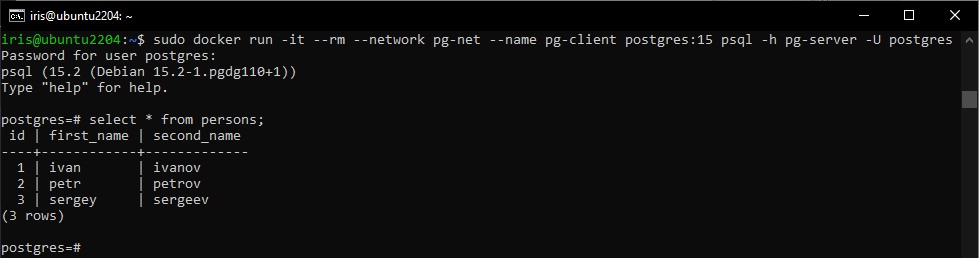
