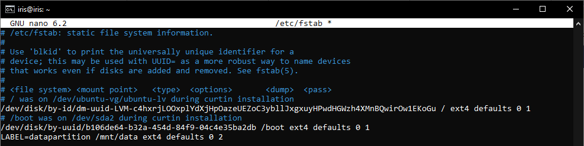
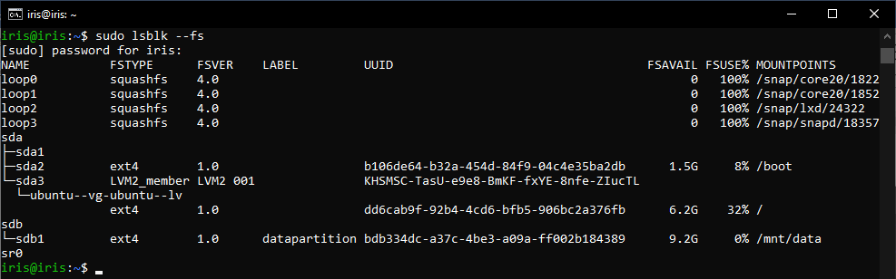
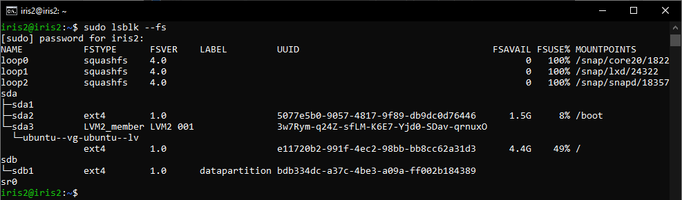
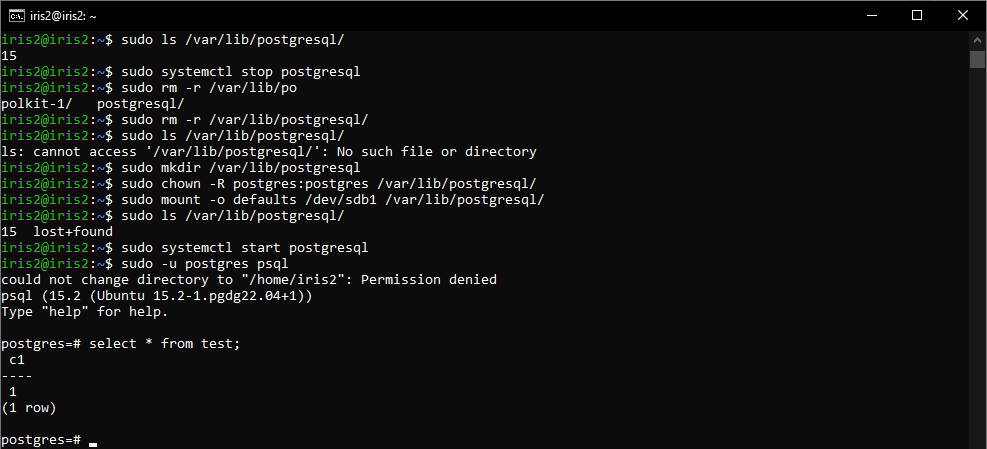

# Домашнее задание №3
1. Развернута ВМ Ubuntu Server 22.04

2. Установлен PostgreSQL 15

3. Проверим, что кластер запущен

4. Авторизуемся из-под пользователя «postgres» в psql, создаем произвольную таблицу с произвольным содержимым

5. Останавливаем PostgreSQL

6. Создан новый диск размером 10GB

7. Согласно инструкции (https://www.digitalocean.com/community/tutorials/how-to-partition-and-format-storage-devices-in-linux), проинициализрован диск и подмонтирована файловая система

8. После перезагрузки ВМ диск остается примонтированным

9. Пользователь «postgres» назначен владельцем «/mnt/data»

10. Содержимое папки «/var/lib/postgres/15» перенесено в папку «/mnt/data»

11. Попытка запустить кластер неуспешна

> Запустить кластер не удалось, т.к. данные были перемещены.

12. Выполнен поиск конфигурационного параметра в файлах, расположенных в директории «/etc/postgresql/15/main», после чего найденный параметр заменен на актуальный.

> Был изменен путь с «/var/lib/postgresql/15/» на «/mnt/data/15/», т.к. ранее были перемещены данные кластера.

13. Попытка запустить кластер успешна

> Удалось запустить кластер, т.к. был указан верный путь в конфигурационном файле.

14. Авторизуемся из-под пользователя «postgres» в psql, проверяем содержимое ранее созданной таблицы

Задание со звездочкой:
не удаляя существующий инстанс ВМ сделайте новый, поставьте на его PostgreSQL, удалите файлы с данными из /var/lib/postgres, перемонтируйте внешний диск, который сделали ранее, от первой виртуальной машины ко второй и запустите PostgreSQL на второй машине так, чтобы он работал с данными на внешнем диске, расскажите, как вы это сделали и что в итоге получилось.

> Развернута ВМ №2 с Ubuntu Server 22.04, на ней установлен PostgreSQL 15, после чего в папку «/var/lib/postgresql/» ВМ №2 примонтирован диск с данными, ранее примонтированный к ВМ №1. PostgreSQL запущен на ВМ №2, данные с ВМ №1 присутствуют.
