# Домашнее задание №4
1. Развернута ВМ Ubuntu Server 22.04

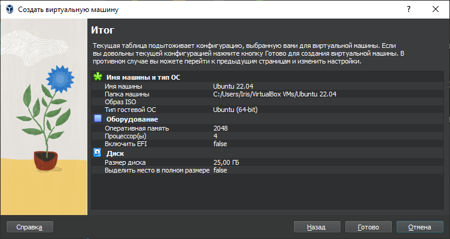
 
2. Установлен PostgreSQL 14

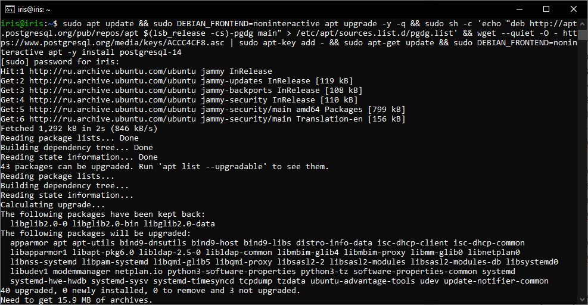

3. Авторизуемся из-под пользователя «postgres» в psql, создаем базу данных «testdb»

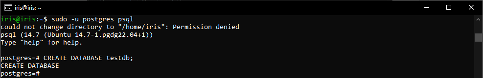

4. Авторизуемся из-под пользователя «postgres» в psql к созданной базе данных «testdb» и создаем новую схему «testnm»

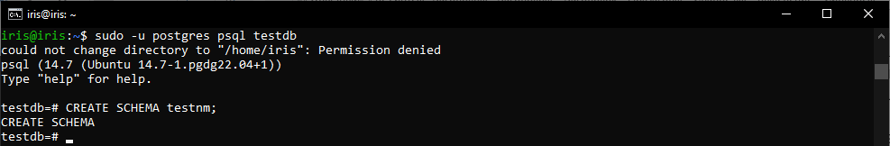

5. Создаем новую таблицу «t1» с одной колонкой «c1» типа integer, вставляем строку со значением c1=1

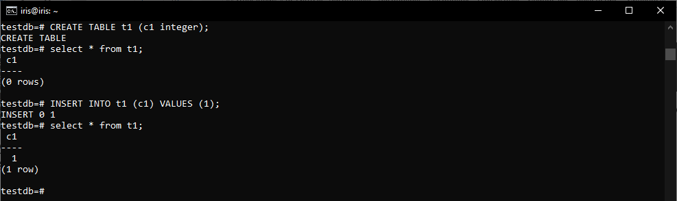

6. Создаем новую роль «readonlyuser» с правами на:
•	подключение к базе данных «testdb»;
•	использование схемы «testnm»;
•	select для всех таблиц схемы «testnm»;
•	select для всех таблиц схемы «public».

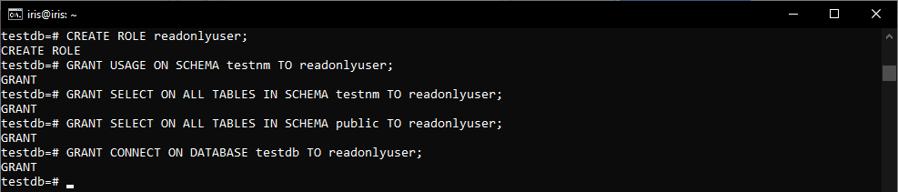

7. Создаем пользователя «testread» с паролем «test123», выдаем ему роль «readonlyuser»

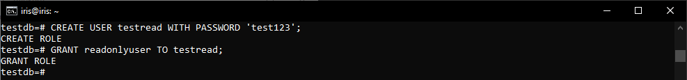

8. Авторизуемся из-под пользователя «testread» в базу данных «testdb»

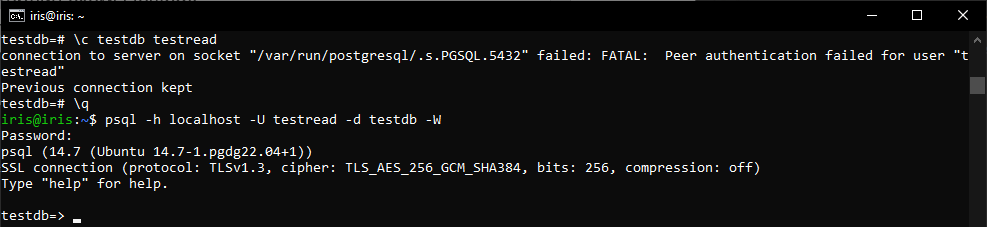

> При попытке сменить пользователя «postgres» на пользователя «testread» можно получить ошибку «connection to server on socket "/var/run/postgresql/.s.PGSQL.5432" failed: FATAL:  Peer authentication failed for user "testread"» – это означает, что в конфигурационном файле установлено значение «peer», оно не позволяет никакому другому пользователю входить в PostgreSQL, кроме пользователей, существующих в ОС.
> <br>
> <br> По умолчанию PostgreSQL подразумевает, что для входа будет использоваться роль, одноименная системному пользователю, и что такая роль будет подключаться к одноименной базе данных. Но в данном случае это не так, потому нужно явно указать опции. Для этого необходимо указать имя пользователя, при помощи которого нужно установить соединение, и имя БД, к которой нужно подключиться. Оператор -h 127.0.0.1 (или -h localhost) указывает, что нужно подключиться к локальной машине по сетевому интерфейсу. Это позволит проходить аутентификацию, даже если имя пользователя и имя роли не совпадают. Флаг –W значит, что при входе в PostgreSQL нужно ввести пароль.

9. Выполним:
   ```
   select * from t1;
   ```

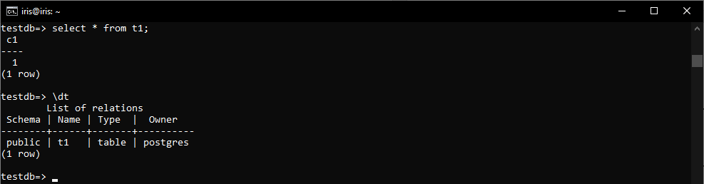

> Выбор из таблицы «t1» возможен, т.к. ранее роли «readonlyuser» были выданы права select схемы «public», а таблица «t1» создана в схеме «public».

10. Авторизуемся из-под пользователя «postgres» в psql, удаляем таблицу «t1»

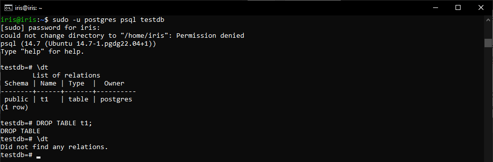

11. Создадим ее заново, но уже с явным указанием имени схемы «testnm», и вставим строку со значением c1=1

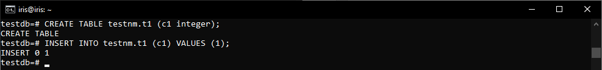

12. Авторизуемся из-под пользователя «testread» в базу данных «testdb», выполним:

   ```
   select * from testnm.t1;
   ```

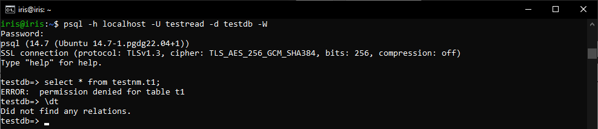

> Выбрать данные не удалось, т.к. ранее мы выдали права на все существующие в тот момент таблицы схемы «testnm», а таблица «t1» в данной схеме была создана позднее.

13. Как сделать так чтобы такое больше не повторялось?

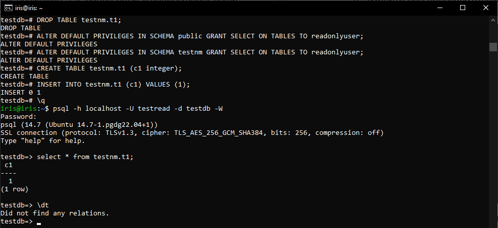

> Необходимо назначить разрешения на чтение всех новых таблиц, созданных в будущем.

14. Выполним:

   ```
   create table t2(c1 integer);
   insert into t2 values (2);
   ```

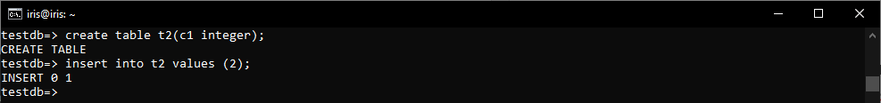

> Мы не отозвали права.

15. Отозвать права:

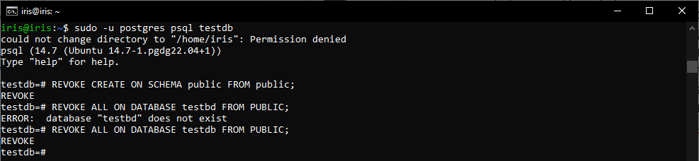

16. Выполним:

   ```
   create table t3(c1 integer);
   insert into t2 values (2);
   ```

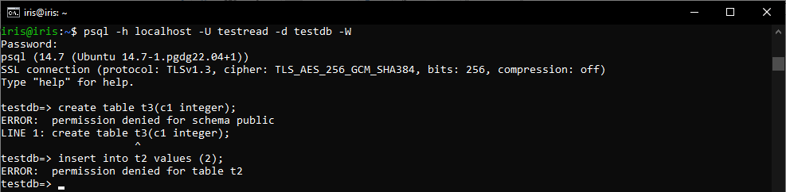
