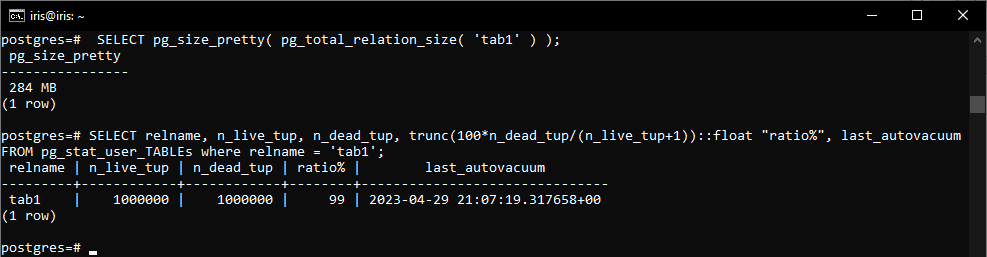

# Домашнее задание №5
1. Развернута ВМ Ubuntu Server 22.04 с 2 ядрами, 4Гб ОЗУ и SSD 10GB


2. Установлен PostgreSQL 15 с дефолтными настройками


3. Для тестов будем использовать БД «postgres»


4. Запустим «pgbench»


5. Изменим параметры настройки PostgreSQL следующим образом (необходимо отредактировать «postgresql.conf»):

|Параметр|Исходное значение|Новое значение|
|--------|-----------------|--------------|
|max_connections|100|40|
|shared_buffers|128MB|1GB|
|effective_cache_size|4GB|3GB|
|maintenance_work_mem|64MB|512MB|
|checkpoint_completion_target|0.9|0.9|
|wal_buffers|-1 (-1 sets based on shared_buffers)|16MB|
|default_statistics_target|100|500|
|random_page_cost|4|4|
|effective_io_concurrency|1|2|
|work_mem|4MB|6553kB|
|min_wal_size|80MB|4GB|
|max_wal_size|1GB|16GB|

6. Протестируем заново


> Тестовый запуск состоял из 1 рабочего процесса pgbench имитирующего транзакции от 8 клиентов в течение 60 секунд, выводя результат каждые 6 секунд.
> <br> В первом тесте мы получили среднюю скорость транзакций tps = 689.
> <br> Во втором тесте скорость транзакций увеличилась до tps = 716, в основном, за счет увеличения:
> <br> - shared_buffers – кэша – рекомендуется начинать настройку 25% от общего размера оперативной памяти, т.е. можно было увеличить на меньший объем;
> <br> - work_mem – количества оперативной памяти, выделяемой серверному процессу для выполнения операций – позволяет выполнять большие по объему операции в оперативной памяти;
> <br> - maintenance_work_mem – количества памяти, отводимой под обслуживающие процессы (vacuum).

7. Создадим таблицу с текстовым полем и заполним случайными данными в размере 1млн строк


8. Посмотрим размер файла с таблицей


9. 5 раз обновим все строчки, добавив к каждой строчке любой символ


10. Посмотрим количество мертвых строчек в таблице и когда последний раз приходил автовакуум


11. Подождем некоторое время, проверяя, пришел ли автовакуум
> Нет, хотя настроен раз в минуту.

12. Еще 5 раз обновим все строчки, добавив к каждой строчке любой символ


13. Посмотрим размер файла с таблицей



14. Отключим автовакуум на нашей таблице


15. Снова 10 раз обновим все строчки, добавив к каждой строчке любой символ, и посмотрим размер файла с таблицей


16. Включаем автовакуум


> При включенном автовакууме размер таблицы увеличился с 65 MB до 284 MB, при выключенном – с 284 MB до 863 MB.
> <br> Выполнив команду «vacuum full», мы получим размер таблицы 81 MB.


 
## Задание со звездочкой:
Написать анонимную процедуру, в которой в цикле 10 раз обновятся все строчки в искомой таблице. Не забыть вывести номер шага цикла.

    ```
    create or replace procedure update_data() as $$
     begin
       for k in 1..10 loop
         update tbl2
         set str = str || '_' || k;
       end loop;
     end;
     $$ language plpgsql;
    ```
    

