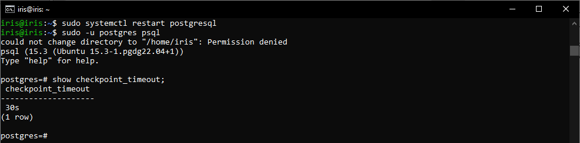
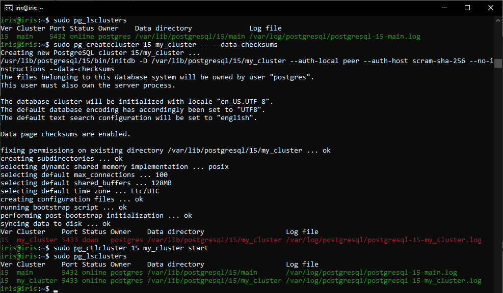
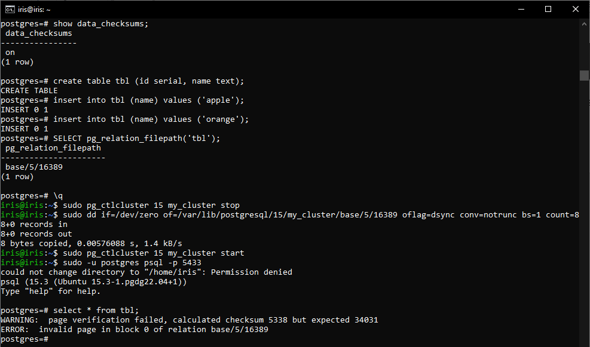

# Домашнее задание №7
0. Подготовка
- Развернута ВМ Ubuntu Server 22.04.

- Установлен PostgreSQL 15.
 
1. Настройте выполнение контрольной точки раз в 30 секунд.

Перезагрузим постгре и проверим результат:

 
2. 10 минут c помощью утилиты pgbench подавайте нагрузку.
Проверим объем журнальных файлов до:

 
Выполним тест производительности с отметкой каждые 60 секунд:

3. Измерьте, какой объем журнальных файлов был сгенерирован за это время. Оцените, какой объем приходится в среднем на одну контрольную точку.

> Получается, что на одну контрольную точку приходится (65 – 17) / 20 = 48 / 20 = 2,4 мегабайта данных.

4. Проверьте данные статистики: все ли контрольные точки выполнялись точно по расписанию. Почему так произошло?

> При выполнении нагрузочного тестирования видим, что все контрольные точки были пройдены.
>   Судя по статистике среднее время выполнения контрольной точки ~27 секунд.
>   Поскольку база была пустой, точки не накладывались друг на друга.
>   При большей нагрузке нет смысла так часто делать контрольные точки.

5. Сравните tps в синхронном/асинхронном режиме утилитой pgbench. Объясните полученный результат.

Убедимся, что включен синхронный режим и выполним замер:

Выключим синхронный режим и перезагрузим постгре:

Повторим тест производительности:

> В синхронном режиме tps ~ 553, в асинхронном режиме tmp ~ 955. Прирост составил ~73%. Причина в более эффективном сбрасывании на диск.
>  
>   При синхронном режиме сервер ждёт сохранения записей WAL транзакции в постоянном хранилище, прежде чем сообщить клиенту об успешном завершении. Таким образом, клиенту гарантируется, что транзакция, которую подтвердил сервер, будет защищена, даже если сразу после этого произойдёт крах сервера. Однако, для коротких транзакций данная задержка будет основной составляющей общего времени транзакции.
>   
>   В режиме асинхронного подтверждения сервер сообщает об успешном завершении сразу, как только транзакция будет завершена логически, прежде чем сгенерированные записи WAL фактически будут записаны на диск. Это может значительно увеличить производительность при выполнении небольших транзакций. Асинхронная фиксация даёт возможность завершать транзакции быстрее, ценой того, что в случае краха СУБД последние транзакции могут быть потеряны. Для многих приложений такой компромисс приемлем.

6. Создайте новый кластер с включенной контрольной суммой страниц. Создайте таблицу. Вставьте несколько значений. Выключите кластер. Измените пару байт в таблице. Включите кластер и сделайте выборку из таблицы. Что и почему произошло? как проигнорировать ошибку и продолжить работу?

Создадим «my_cluster», сразу включив контроль сумм, и запустим класстер:

По умолчанию контроль суммы страниц был включен, убедимся в этом, после чего создадим табличку и заполним ее некоторыми данными. Остановим сервер и поменяем несколько байтов в странице (сотрем из заголовка LSN последней журнальной записи):

> data_checksums гарантирует целостность на уровне байтов в файлах, именно поэтому мы получили сообщение о том, что файл был поврежден

Есть несколько вариантов решения данной проблемы:
1. найти и удалить поврежденные строки (если потеря не критична);
2. восстановить поврежденные строки из бэкапа (при наличии);
3. в текущей сессии проигнорировать ошибку;
4. занулить строки (установить параметр zero_damaged_pages = on) и выполнить полный вакуум.

В моем случае восстановить данные способом №4 не удалось: 

