# Домашнее задание №8
0. Подготовительные работы
0.1. Развернуть ВМ Ubuntu 22.04 (4 ГБ ОЗУ, 75 ГБ ПЗУ, 6 ЦПУ)

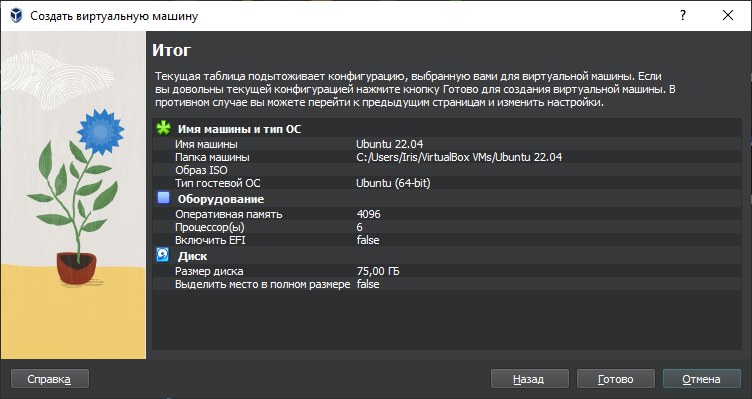

0.2. Развернуть PostgreSQL 15

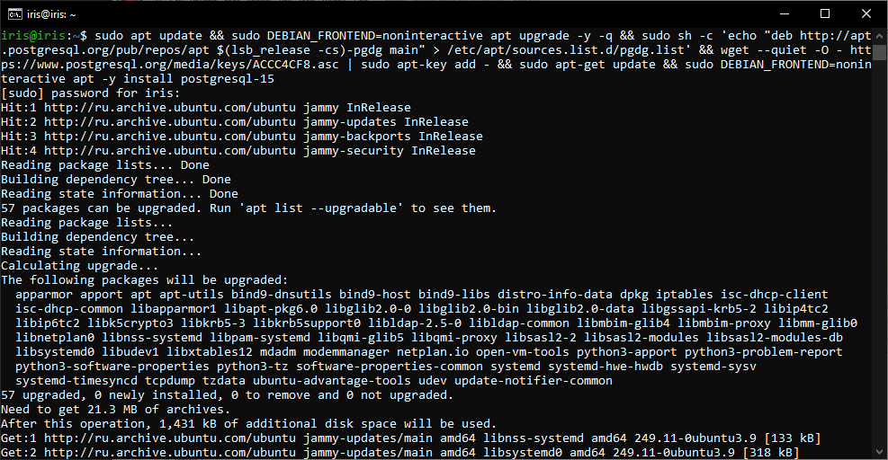

1. Выполнить нагрузочное тестирование производительности системы с помощью утилиты pgbench (https://postgrespro.ru/docs/postgrespro/14/pgbench)
1.1 Выполнить тестирование производительности с настройками по умолчанию.
1.2 Настроить кластер PostgreSQL 15 на максимальную производительность, не обращая внимание на возможные проблемы с надежностью в случае аварийной перезагрузки виртуальной машины.
1.3 Нагрузить кластер через утилиту через утилиту pgbench.
1.4 Написать какого значения tps удалось достичь, показать какие параметры в какие значения устанавливали и почему.

Тест №1

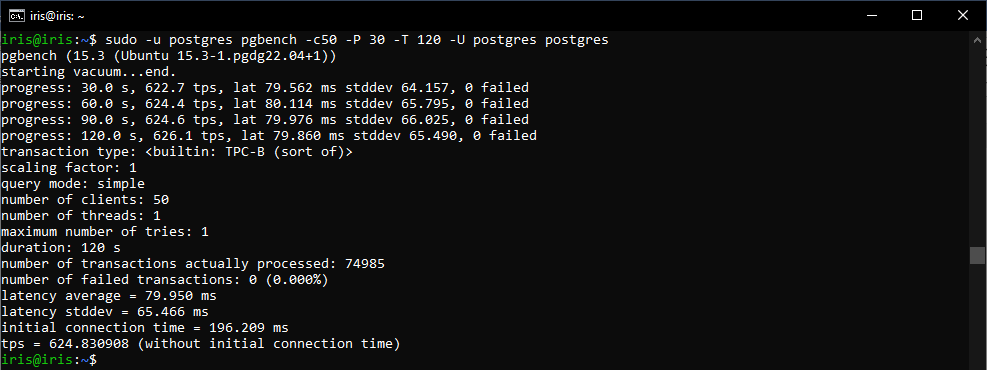

> Тестовый запуск состоял из 1 рабочего процесса pgbench имитирующего транзакции от 50 клиентов в течение 120 секунд, выводя результат каждые 30 секунд.
><br> В первом тесте мы получили среднюю скорость транзакций tps = 624.

Выполним 2 теста с «рекомендуемыми» и «максимально эффективными» настройками. Для этого применим параметры настройки PostgreSQL в соответствии с таблицей:

| Параметр | Значение по умолчанию (тест №1) | Рекомендуемое значение (тест №2) | Максимально эффективное значение (тест №3) |
|----------|---------------------------------|----------------------------------|--------------------------------------------|
|shared_buffers|128 MB|512 MB (25% RAM)|820 MB (40% RAM)|
|max_connections|100|55|55|
|effective_cache_size| |1536 MB (75% RAM)|1536 MB (75% RAM)|
|work_mem| |10 (Total RAM * 0.25 / max_connections)|10 (Total RAM * 0.25 / max_connections)|
|maintenance_work_mem| |64 MB|512 MB|
|wal_buffers|-1 (-1 sets based on shared_buffers)|16 MB|16 MB|
|min_wal_size|80 MB|4 GB|4 GB|
|max_wal_size|1 GB|16 GB|16 GB|
|checkpoint_timeout|5 min|30 min|60 min|
|effective_io_concurrency| |200|1000|

Тест №2

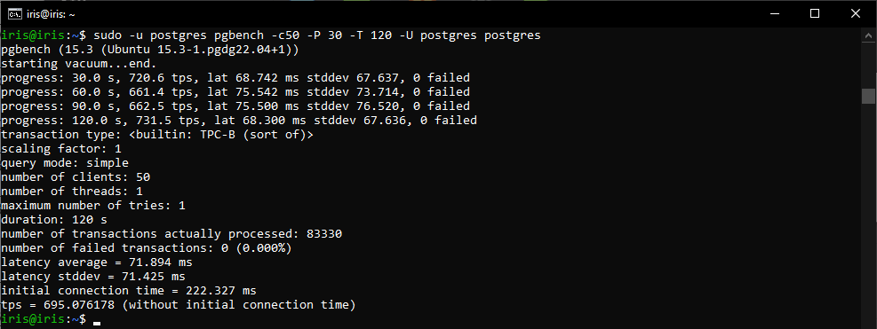

> Во втором тесте мы получили среднюю скорость транзакций tps = 695.

Тест №3

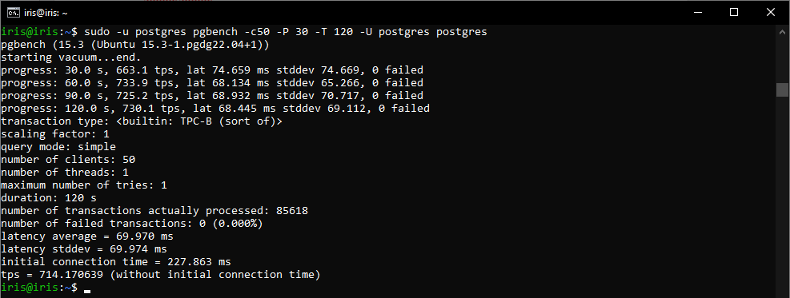

> В третьем тесте мы получили среднюю скорость транзакций tps = 714.

Тест №4
Включим асинхронный режим:

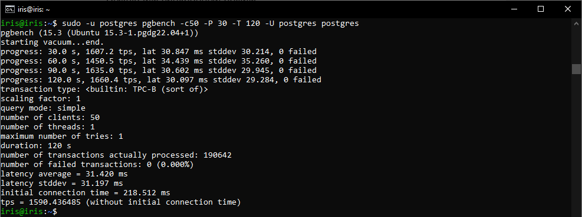

> В четвертом тесте мы получили среднюю скорость транзакций tps = 1590.

> Вывод:
><br> Мы получили относительно небольшой прирост производительности, увеличив shared_buffers, work_mem, maintenance_work_mem и др. параметры.
><br> От включения асинхронного режима мы получили х2 производительности.

## Задание со *
Аналогично протестировать через утилиту https://github.com/Percona-Lab/sysbench-tpcc (требует установки https://github.com/akopytov/sysbench)

1. Выполним установку утилиты: 

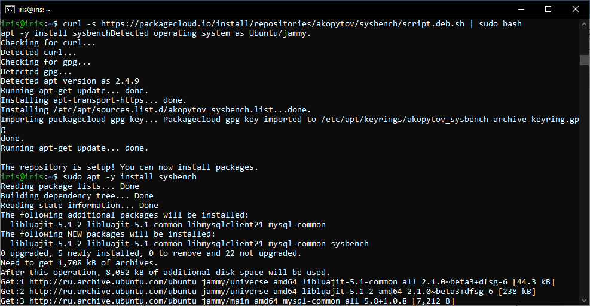

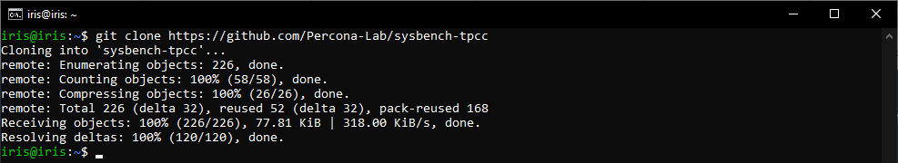
 
2. Сгенерируем тестовые данные

```
./tpcc.lua --pgsql-user=postgres --pgsql-db=postgres --pgsql-password=postgres --time=120 --threads=2 --report-interval=30 --tables=10 --scale=10 --use_fk=0  --trx_level=RC --db-driver=pgsql prepare
```

4. Тест №1: tps = 91

```
./tpcc.lua --pgsql-user=postgres --pgsql-db=postgres --pgsql-password=postgres --time=120 --threads=2 --report-interval=30 --tables=10 --scale=10 --use_fk=0  --trx_level=RC --db-driver=pgsql run
```

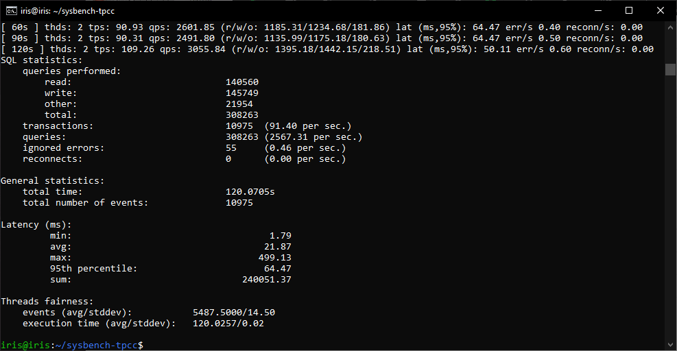

4. Тест №2: tps = 117

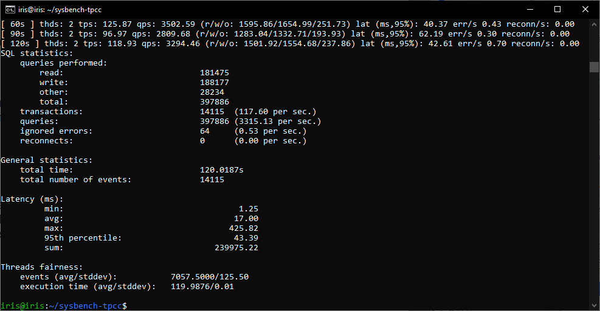

5. Тест №3: tps = 125

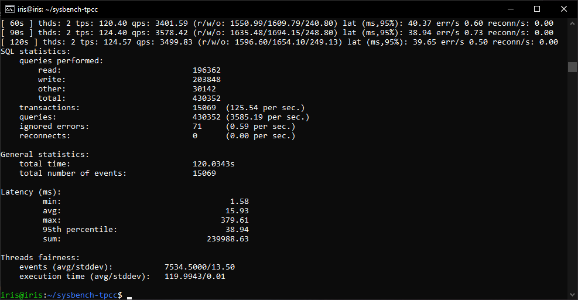

6. Тест №4 (включен асинхронный режим): tps = 136

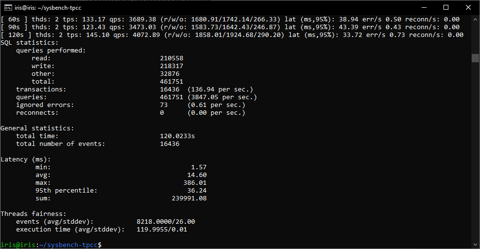

> При выполнении задания изучены доп. материалы: https://www.percona.com/blog/tuning-postgresql-for-sysbench-tpcc/
><br> Понадобилось обновить пароль для юзера «postgres» (alter user postgres password 'postgres').
><br> На мой взгляд, с помощью утилиты pgbench тест производительности выполнить проще.

